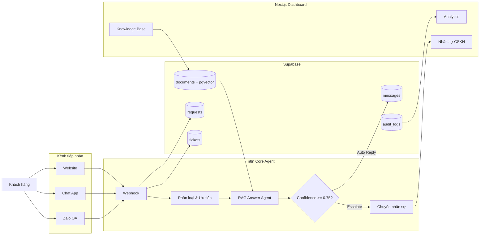

# RAG Customer Support Automation

Hệ thống chăm sóc khách hàng đa kênh giúp tự động tiếp nhận, phân loại và xử lý yêu cầu khách hàng bằng mô hình RAG (Retrieval-Augmented Generation). Các yêu cầu có thể được trả lời tự động khi đủ độ tin cậy hoặc chuyển tiếp cho nhân sự xử lý khi cần.

**Tech Stack**

- **n8n** – Điều phối workflow và AI Agent
- **Next.js** – Website công khai và dashboard vận hành
- **Supabase** – PostgreSQL, pgvector, Auth và realtime data
- **OpenAI** – Embeddings và LLM cho phân loại, RAG

---

## Kiến trúc tổng quan



---

## Luồng xử lý

1. Khách hàng gửi yêu cầu từ Website, Chat App hoặc Zalo.
2. n8n nhận dữ liệu qua webhook và chuẩn hóa về một schema chung.
3. AI Agent phân loại yêu cầu, xác định mức độ ưu tiên và loại bỏ spam/trùng lặp.
4. Agent RAG truy vấn kho tri thức trong Supabase Vector Store.
5. Hệ thống sinh câu trả lời kèm điểm tin cậy (`confidence`).
6. Nếu độ tin cậy đủ cao, hệ thống tự động phản hồi khách hàng.
7. Nếu độ tin cậy thấp hoặc cần can thiệp thủ công, ticket được chuyển cho nhân sự.
8. Toàn bộ dữ liệu và lịch sử xử lý được lưu trong Supabase và hiển thị trên Dashboard.

---

## Cấu trúc dự án

```text
support-agent-project/
├── README.md                     ← file này
├── supabase/
│   └── schema.sql                ← chạy 1 lần trong Supabase SQL Editor
├── n8n/
│   ├── core-agent-workflow.json  ← workflow chính: phân loại, RAG, escalate
│   ├── kb-indexing-workflow.json ← workflow phụ: chunk + embed tài liệu
│   ├── build_workflow.py         ← script sinh workflow chính
│   └── build_kb_workflow.py      ← script sinh workflow KB
└── web/
    ├── app/
    ├── components/
    ├── lib/
    └── .env.example
```
